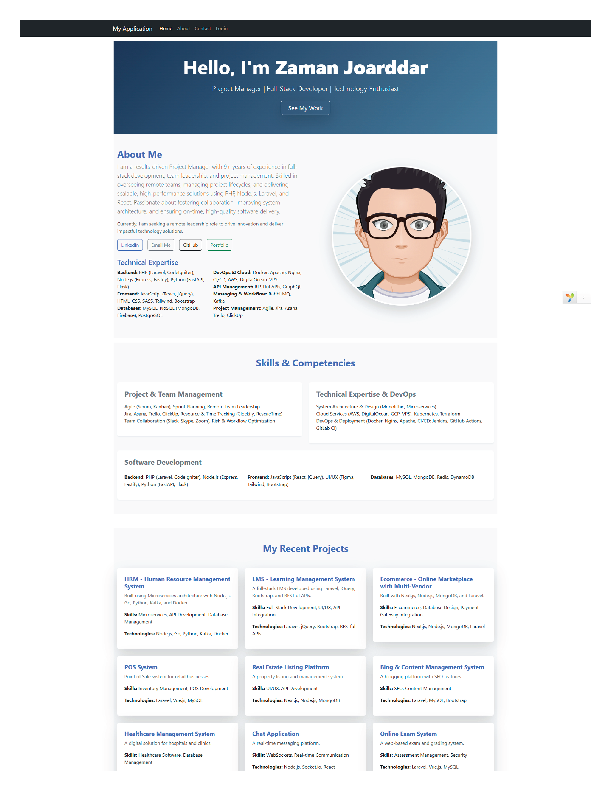
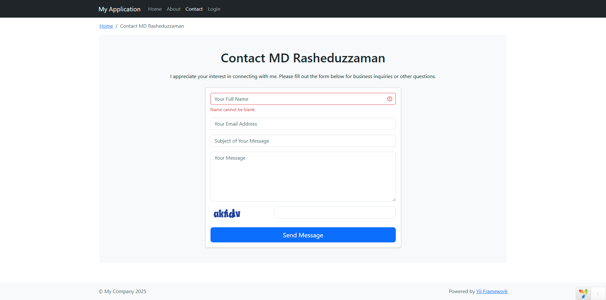

# Portfolio Site - Zaman


This is a portfolio site built with the Yii2 PHP framework, showcasing my professional experience, skills, and projects. The website includes an interactive contact form, sections for project details, and an overview of my work experience.

## Table of Contents

- [Project Overview](#project-overview)
- [Technologies Used](#technologies-used)
- [Setup Instructions](#setup-instructions)
- [Contact Form](#contact-form)
- [Screenshots](#screenshots)
- [License](#license)

## Project Overview

This portfolio site is developed using the Yii2 framework to demonstrate my experience as a Project Manager and Senior Developer. The website includes:
- A **Home Page** that introduces me and highlights my skills and competencies.
- An **About Page** that outlines my professional experience and educational background.
- A **Contact Page** with a contact form where users can send inquiries.
  
### Features:
- **Interactive Contact Form**: Powered by Yii2 ActiveForm.
- **Responsive Design**: Built with Bootstrap 5 for mobile and desktop optimization.
- **Secure Captcha**: To prevent spam submissions.
  
## Technologies Used

- **PHP (Yii2 Framework)**: For building the server-side structure.
- **HTML5, CSS3**: For front-end development and responsive design.
- **Bootstrap 5**: For a responsive and visually appealing layout.
- **Yii2 ActiveForm**: For creating and validating the contact form.
- **Captcha**: For adding an anti-spam feature to the contact form.
- **MySQL**: For database storage (if you plan to add a database for messages).
- **Docker** (Optional): For containerizing the application for local and production environments.

## Setup Instructions

To set up this portfolio site locally, follow these steps:

### Prerequisites:
- PHP 7.4 or higher
- Composer
- MySQL (or a database of your choice)
- Yii2 Framework

### 1. Clone the repository:
```bash
git clone https://github.com/mrzamanj/portfolio-site-php-yiiframework.git
```

### 2. Install dependencies:
Navigate to the project directory and install the required dependencies using Composer.

```bash
cd portfolio-site-php-yiiframework
composer install
```

### 3. Configure the database (if applicable):
If you're using a database for storing contact form submissions, configure your database settings in the `config/db.php` file.

```php
return [
    'class' => 'yii\db\Connection',
    'dsn' => 'mysql:host=localhost;dbname=your_db_name',
    'username' => 'your_db_username',
    'password' => 'your_db_password',
    'charset' => 'utf8',
];
```

### 4. Run migrations (if necessary):
If you need to create database tables for the contact form, run the migrations (if any).

```bash
php yii migrate
```

### 5. Run the application:
Start the Yii2 development server.

```bash
php yii serve
```

Visit `http://localhost:8080` in your browser to view the portfolio.

## Contact Form

The contact form allows visitors to send messages directly to my email. The form includes the following fields:
- Name
- Email
- Subject
- Message
- Captcha (for spam protection)

Messages submitted via the contact form will be stored and processed accordingly.

## Screenshots

Here are some screenshots of the portfolio site:

- **Home Page**: 
- **About Page**: 
- **Contact Form**: 

## License

This project is open-source and available under the [MIT License](LICENSE). 